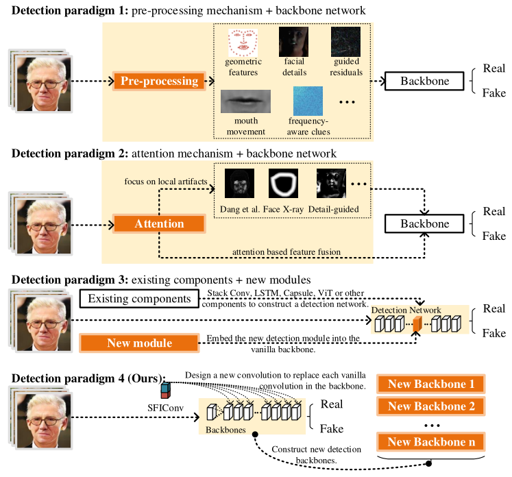

# 【TIFS24】Constructing New Backbone Networks via Space-Frequency Interactive Convolution for Deepfake Detection

Zhiqing Guo<sup>1</sup>, 
Zhenhong Jia<sup>1</sup>,
Liejun Wang<sup>1</sup>,
Dewang Wang<sup>2</sup>,
Gaobo Yang<sup>2</sup>,
and Nikola Kasabov<sup>3</sup></br>
<sup>1</sup> Xinjiang University, China; 
<sup>2</sup> Hunan University, China; 
<sup>3</sup> Auckland University of Technology, New Zealand</br>



## Abstract
The serious concerns over the negative impacts of Deepfakes have attracted wide attentions in the community of multimedia forensics. The existing detection works achieve deepfake detection by improving the traditional backbone networks to capture subtle manipulation traces. However, there is no attempt to construct new backbone networks with different structures for Deepfake detection by improving the internal feature representation of convolution. In this work, we propose a novel Space-Frequency Interactive Convolution (SFIConv) to efficiently model the manipulation clues left by Deepfake. To obtain high-frequency features from tampering traces, a Multichannel Constrained Separable Convolution (MCSConv) is designed as the component of the proposed SFIConv, which learns space-frequency features via three stages, namely generation, interaction and fusion. In addition, SFIConv can replace the vanilla convolution in any backbone networks without changing the network structure. Extensive experimental results show that seamlessly equipping SFIConv into the backbone network greatly improves the accuracy for Deepfake detection. In addition, the space-frequency interaction mechanism does benefit to capturing common artifact features, thus achieving better results in cross-dataset evaluation.

## Usage of SFIConv-ResNet
1. Configure the environment according to requirements.txt.
2. Change the data path in train.py file
3. Run code for model training：
```python train.py```

## Citation
Please cite our paper if the code is used in your research:
```
@ARTICLE{guo2024Constructing,
  author={Guo, Zhiqing and Jia, Zhenhong and Wang, Liejun and Wang, Dewang and Yang, Gaobo and Kasabov, Nikola},
  journal={IEEE Transactions on Information Forensics and Security}, 
  title={Constructing New Backbone Networks via Space-Frequency Interactive Convolution for Deepfake Detection}, 
  year={2024},
  volume={19},
  number={},
  pages={401-413},
  doi={10.1109/TIFS.2023.3324739}}
```
